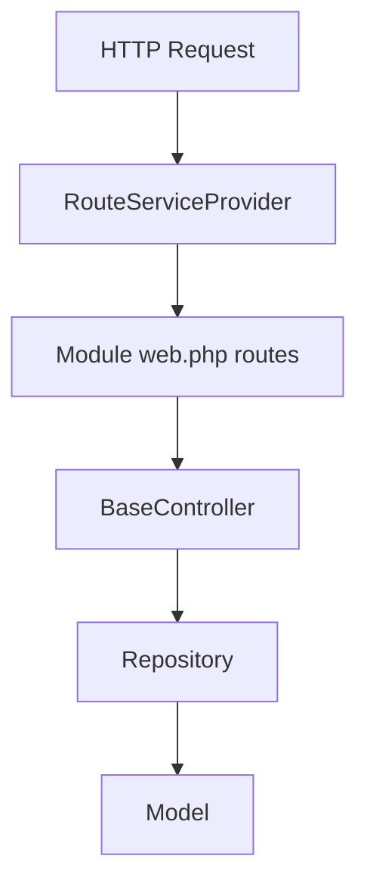
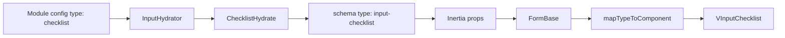

# Architecture

Modularous is a modular Laravel admin package with Vue/Vuetify and Inertia. It uses the Repository pattern, config-driven forms/tables, and a Hydrate system to transform module config into frontend schema.

## Directory Structure

```
packages/modularous/
├── src/                    # PHP package source
│   ├── Modularity.php      # Module manager (extends Nwidart FileRepository)
│   ├── Module.php          # Single module representation
│   ├── Console/            # Artisan commands (Make, Cache, Migration, etc.)
│   ├── Hydrates/           # Schema hydration (InputHydrator → *Hydrate)
│   ├── Http/Controllers/   # BaseController, PanelController
│   ├── Repositories/       # Repository + Logic traits
│   ├── Services/           # Connector, Currency, Roles, etc.
│   ├── Entities/           # Models, traits, enums
│   ├── Generators/         # RouteGenerator, stubs
│   ├── Support/            # Finder, CommandDiscovery, routing
│   └── Providers/          # BaseServiceProvider, RouteServiceProvider
└── vue/src/js/             # Frontend
    ├── components/         # inputs, layouts, table, modals
    ├── hooks/              # useForm, useTable, useInput, etc.
    ├── utils/              # schema, helpers, getFormData
    └── store/              # Vuex (config, user, language, etc.)
```

## Request Flow



1. **RouteServiceProvider** maps module routes from each enabled module's `Routes/web.php`
2. **BaseController** (via PanelController) resolves repository, model, route from route name
3. **Repository** handles all data access; controllers use `$this->repository`
4. **Finder** resolves model/repository/controller classes from route name or table

## Schema Flow (Form Inputs)



1. **Module config** defines inputs with `type` (e.g. `checklist`, `select`, `price`)
2. **InputHydrator** resolves `{Studly}Hydrate` from `studlyName($input['type']) . 'Hydrate'`
3. **Hydrate** sets `$input['type'] = 'input-{kebab}'` and enriches schema
4. **Inertia** passes hydrated schema to the page
5. **FormBase** flattens schema; **FormBaseField** uses `mapTypeToComponent(type)` → Vue component

## Core Classes

| Class | Purpose |
|-------|---------|
| **Modularity** | Module manager; scan, cache, paths, auth names |
| **Module** | Single module; config, route names, getRepository(), getModel() |
| **Finder** | Resolve model/repository/controller from route or table |
| **Repository** | Data access; create/update lifecycle, Logic traits |
| **InputHydrator** | Entry point; delegates to `{Type}Hydrate` |

## Provider Chain

```
LaravelServiceProvider (publish config, assets, views)
        ↓
BaseServiceProvider (register Modularous, bindings, commands, migrations)
        ↓
RouteServiceProvider (map system routes, module routes, auth routes)
```
