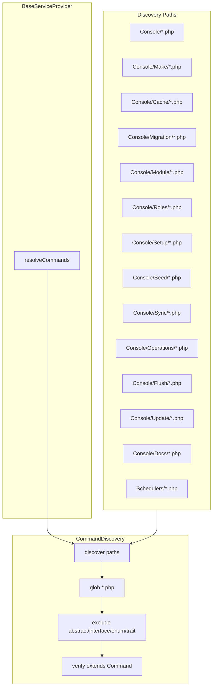

# Console Commands — Structure & Conventions

This document describes the Modularous console command architecture, naming conventions, and rules for adding or modifying commands.

## Architecture Overview



Commands are **auto-discovered** via `CommandDiscovery::discover()` in `BaseServiceProvider`. No manual registration is required. Place a command class in a scanned path and it will be registered.

## Folder Structure

| Folder | Purpose | Class Pattern |
|--------|---------|----------------|
| `Console/` (root) | Build, refresh, pint, dev, replace:regex, composer, etc. | `*Command` |
| `Console/Make/` | Artifact generators (scaffolding) | `Make*Command` |
| `Console/Cache/` | Cache operations | `Cache*Command` |
| `Console/Migration/` | Migration operations | `Migrate*Command` |
| `Console/Module/` | Route enable/disable, fix module, remove module | `*Command` |
| `Console/Roles/` | Roles load, refresh, rollback, list, super-admin | `Roles*Command` |
| `Console/Setup/` | Install, create superadmin, create database, setup development | `*Command` |
| `Console/Seed/` | Seed payment, pricing, VAT rates | `Seed*Command` |
| `Console/Sync/` | Sync translations, states | `Sync*Command` |
| `Console/Operations/` | Process, publish one-time operations | `*Command` |
| `Console/Flush/` | Flush, flush sessions, flush filepond | `Flush*Command` |
| `Console/Update/` | Update Laravel configs | `Update*Command` |
| `Console/Docs/` | Generate command docs | `Generate*Command` |
| `Schedulers/` | Scheduler commands (package root) | `*Command` |
| `Console/Coverage/` | Coverage (CoverageServiceProvider only) | `Coverage*Command` |

## Naming Rules

### Rule 1: Class Name ↔ Signature Compatibility

**Class names must reflect the command signature.** Convert signature segments to PascalCase and append `Command`.

| Signature | Class |
|-----------|-------|
| `modularous:make:module` | `MakeModuleCommand` |
| `modularous:cache:clear` | `CacheClearCommand` |
| `modularous:route:disable` | `RouteDisableCommand` |
| `modularous:create:database` | `CreateDatabaseCommand` |

### Rule 2: Semantic Namespaces

| Namespace | Meaning | Example |
|-----------|---------|---------|
| `modularous:make:*` | Scaffold/generate files | `make:module`, `make:controller` |
| `modularous:create:*` | Create runtime records (DB, users) | `create:superadmin`, `create:database` |
| `modularous:cache:*` | Cache operations | `cache:clear`, `cache:warm` |
| `modularous:migrate:*` | Migration operations | `migrate`, `migrate:refresh` |
| `modularous:flush:*` | Flush/clear runtime data | `flush:sessions` |
| `modularous:route:*` | Route enable/disable | `route:disable` |
| `modularous:sync:*` | Sync data | `sync:translations` |

### Rule 3: Command Suffix

All command classes MUST end with `Command` (e.g. `InstallCommand`, not `Install`).

## Adding a New Command

1. **Choose the correct folder** based on the command's purpose.
2. **Name the class** according to the signature (e.g. `modularous:my:action` → `MyActionCommand`).
3. **Extend** `BaseCommand` (or `Illuminate\Console\Command` if BaseCommand is not needed).
4. **Place the file** in the appropriate folder — discovery will pick it up automatically.
5. **Add tests** in `tests/Support/CommandDiscoveryTest.php` if it should be explicitly asserted.

## CommandDiscovery

- **Location:** `src/Support/CommandDiscovery.php`
- **Behavior:** Scans glob paths, extracts FQCN from file content, excludes abstract/interface/enum/trait, verifies class extends `Command`.
- **Paths:** Defined in `BaseServiceProvider::resolveCommands()`.

## BaseCommand

- **Location:** `src/Console/BaseCommand.php`
- **Use:** For commands that need Modularous-specific behavior (trait options, config, etc.).
- **Alternative:** Use `Illuminate\Console\Command` for simple commands.

## Backward Compatibility

When renaming commands, add the old signature as an **alias**:

```php
protected $aliases = [
    'modularous:old:signature',
];
```

## Reference

Full command mapping: see `docs/src/pages/system-reference/console-conventions.md` (VitePress).
